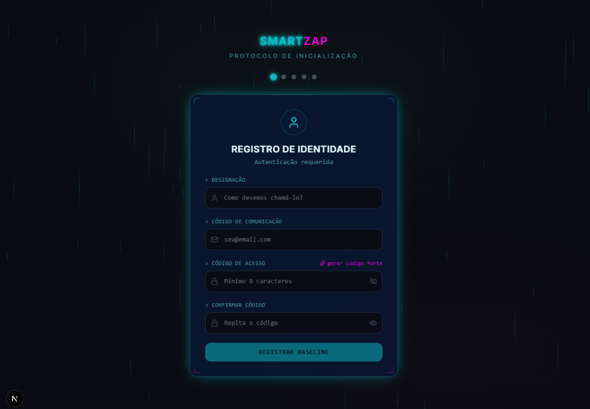

# SmartZap - Gerenciador Inteligente para WhatsApp 🚀

Um gerenciador completo para automação de marketing inteligente e CRM integrado via **WhatsApp**, utilizando a **Evolution API**.
Projetado para ser um SaaS multi-tenant ou uso interno com escalabilidade moderna, este projeto foi desenvolvido com tecnologias de ponta.



## ✨ Principais Funcionalidades

- **Automação de Marketing:** Dispare campanhas em massa de forma inteligente.
- **CRM Integrado:** Gerencie seus contatos (Leads), templates e submissões em uma *Inbox* visual incrível.
- **Onboarding e Assistente de Instalação (Setup Wizard):** Todo o fluxo de saúde da aplicação e provisionamento de infraestrutura conta com um visual imersivo e *Cyberpunk*, desde a tela de Registro de Identidade.
- **Integração Evolution API:** Conectividade escalável para envios massivos simulando humano e gerenciamento de sessões no WhatsApp.
- **Filas de Tarefas Assíncronas:** Gerenciamento pesado de tarefas via QStash e Background Jobs seguros.
- **Aesthetic Premium:** Uma UI/UX inspirada num design Neon/Dark Mode limpo e sofisticado com *TailwindCSS*, *Framer Motion* e *shadcn/ui*.

## 🛠️ Tecnologias Utilizadas

- **Core:** Next.js 15 (App Router, Turbopack, React 19)
- **Backend/Banco de Dados:** Supabase (PostgreSQL, Realtime, Auth, Storage)
- **Filas & Cache:** Upstash (QStash, Redis)
- **API WhatsApp:** Evolution API (e Cloud API fallback)
- **UI/Estilização:** TailwindCSS, Shadcn UI, Framer Motion, Lucide Icons
- **Hospedagem Recomendada:** Vercel (Edge Functions, Serverless)

---

## 🚀 Como fazer o Deploy

A maneira mais fácil de publicar a sua versão em produção do SmartZap é através da Vercel:

[](https://vercel.com/new/clone?repository-url=https%3A%2F%2Fgithub.com%2FUriBarros%2Fsmartzapv1)

### Requisitos de Infraestrutura

Para a aplicação funcionar em produção você precisará de:
1. Um projeto no **Supabase**
2. Uma conta no **Upstash** (com um cluster Redis e um Token QStash)
3. Conexão na Vercel para carregar as Variáveis de Ambiente.

*O nosso **Assistente de Instalação Interno** (/install) ajudará a configurar essas chaves pelo próprio navegador assim que a aplicação for iniciada na Vercel!*

## 💻 Desenvolvimento Local

```bash
# 1. Clone o repositório
git clone https://github.com/UriBarros/smartzapv1.git

# 2. Acesse a pasta do projeto
cd smartzapv1

# 3. Instale as dependências
npm install

# 4. Inicie o Servidor de Desenvolvimento
npm run dev
```

---
© 2024-2026 SmartZap Software. Todos os direitos reservados.
